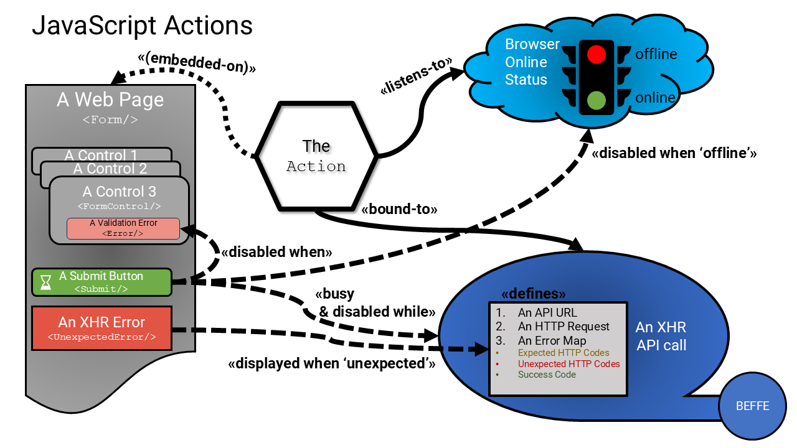

# JavaScript Actions

## Overview

JavaScript "Actions" are a strategy (in web-based clients) that provides consistency and durability in user interfaces, which results in better usability of a product in a way that helps engineers create new user interfaces quickly and reliably.

Building a user interface is a complex activity, usually focused on getting something working per design. In this pursuit, it is very easy for an engineer to handle very basic usability issues like handling errors, dealing with network connectivity, and helping the user "fall into the pit of success," as opposed to allowing them to easily fail to do whatever it is they want to achieve by using the product.

End users really don't want to be using systems that fail often, and in the internet-dominated world of unreliable connectivity, this is quite tricky to achieve well without armies of engineers and testers in hand.

What is needed is a general-purpose mechanism that helps engineers focus on solving the happy path, which is backed up by built-in mechanisms that handle the unhappy paths.

That is exactly why we have designed "JavaScript Actions".

(Read: this [Design Decision](../decisions/0170-javascript-actions.md) for more examples on why this mechanism is required)

## Implementation

Here is a JavaScript Action.

The action is used in all interactive UI pages/components that make calls to backend APIs.

The action is a simple 'class' derived from a base implementation, either wired into a JavaScript framework or into custom JavaScript components.

The action is always bound to:

1. An `IOfflineService`, that monitors the 'online' status of the browser/device
2. An XHR API call with a defined set of expected errors with end-user specific messages, an optional set of unexpected errors with end-user specific messages, and an option set of success codes (per every API call).

The action can also optionally be bound to: A UI form, that uses action-enabled for controls, and components

### How It Works

Regardless of the JavaScript architecture or JavaScript framework itself (e.g., VueJs, ReactJs, JQuery, etc.) or hand rolled, there are some default behaviors that Actions must perform.

> Implementation details vary, but all these behaviors can be implemented with any of these frameworks or approaches.

#### Offline Handling

The `IOfflineService` actively monitors the browser's network connectivity.

* This service actively/passively detects when connectivity is lost using various strategies (i.e., polling),
* It maintains a state of 'online' or 'offline'.
* This service must also be updated whenever any XHR call fails due to loss of connectivity, and when it is, it must then actively detect when connectivity is restored.

The action is always wired into this `IOfflineService`:

If 'offline':

* The UI will indicate that the user experience is offline (e.g., a banner on top of the page).
* No XHR API call can be made. See "XHR Handling" below for more details.
* If the action is bound to a `<Form/>`, then see "Form Handling" below

If 'online':

* The UI will indicate that the user experience is online (e.g., hide the offline banner on top of the page).
* The bound XHR call will be allowed to be made. See "XHR Handling" below for more details.
* If the action is bound to a `<Form/>`, then see "Form Handling" below

#### XHR Handling

All actions are bound to a mandatory XHR definition, which will define an HTTP request, a URL, and optionally collections of 'expected' and 'unexpected' errors, with messages to be shared with end users, should they arise.

* The XHR call can be made programmatically by the action.
* The bound XHR call will be allowed to be made only when the `IOfflineService.status` is 'online'
* When the call is being made, the action will block the XHR call from being made again until the existing call is returned.
* If the action is bound to a `<Form/>,` then:
   * The `<Submit/>` control will be wired up to invoke the XHR call.
   * When the XHR returns an 'offline' error, the `IOfflineService` status is updated.
   * See "Form Handling" below for more details

#### Form Handling

The action can be optionally bound to a `<Form/>`; when it is, there are a number of form-based controls that can interact with the Action, to handle "offline" status, XHR status, and any error responses, and handle form validation.

These three integrated mechanisms do much of the heavy lifting for engineers. All they have to do is wire them up correctly.

When the `IOfflineService.status` is "offline":

* The `<Submit/>` control will be disabled.
* The `<Form/>` will indicate that the user experience is offline (e.g., display a footer text under the `<Submit/>` button)

When the `IOfflineService.status` is "online":

* The `<Submit/>` control will be enabled.
* The `<Submit/>` button can invoke the XHR call, and when it does:
   * The `<Submit/>` button will be disabled
   * The `<Submit/>` button will display a "busy" cue (e.g., a spinner on the button or a spinner on the page)
   * When the XHR is returned (success or error), the `<Submit/>` button is enabled again, and the "busy" cue is hidden.
   * When the XHR returns an 'unexpected' error, the `<UnexpectedError/>` control is updated with a general error (e.g., one that asks the user to opt into reporting the error) and other relevant context to encourage the user to submit a user-defined crash report for the support team. Also, the error must be logged to the `IRecorderService.crash()`.
   * When the XHR returns an 'expected' error, the built-in `<Error/>` control (on the `<Form/>`) is updated with the error message. Or an appropriate page is navigated to. Or another action is used specific to that error.
